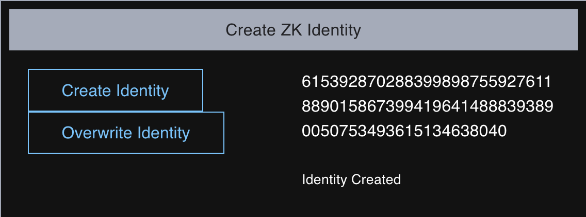
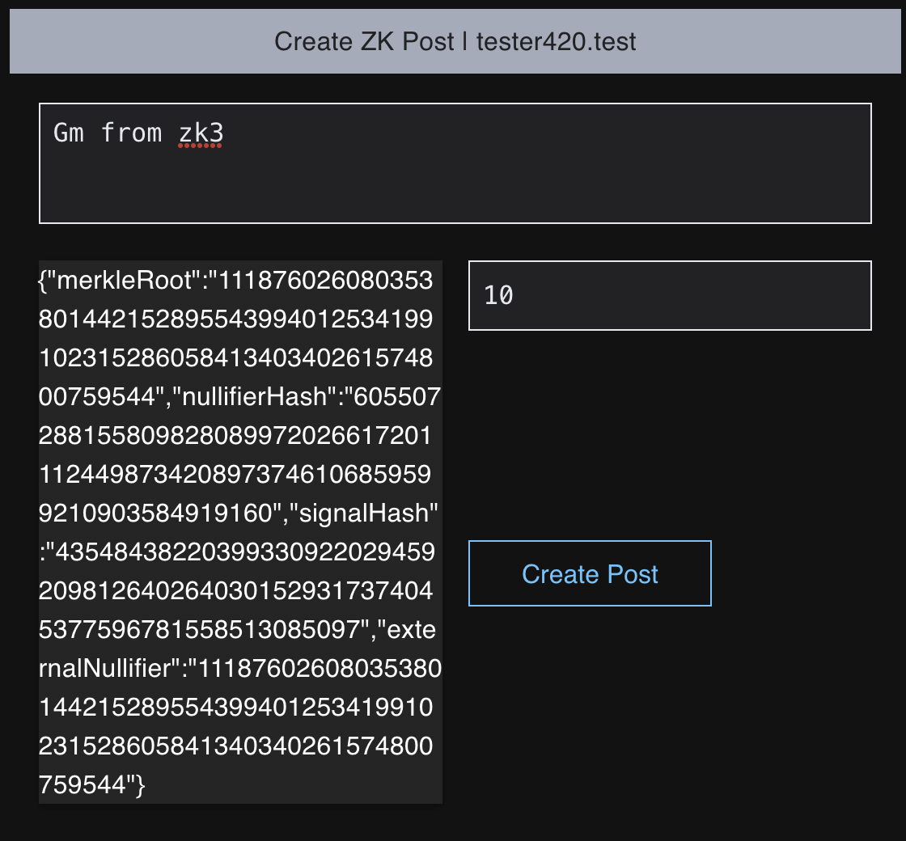
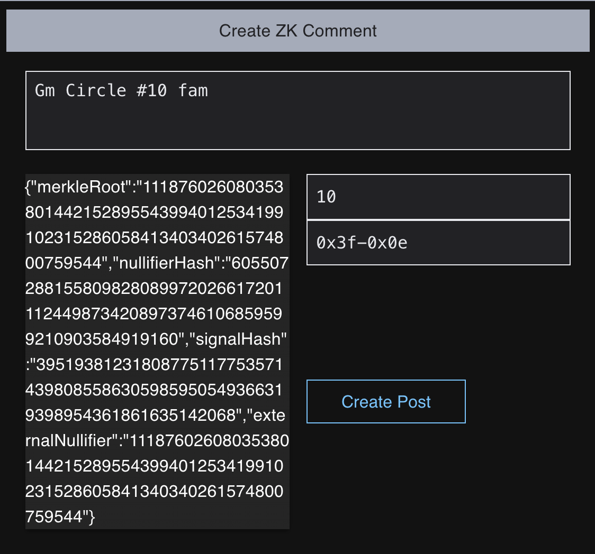

# Zk3: Lens Protocol + Semaphore
ZKenabled Social Protocol

# OVERVIEW
This document describes SemaphoreZK3 - a Lens Protocol + Semaphore Integration that allows users of the Lens protocol to create zkProofs using semaphore that are verified and enforced by Lens to govern post interactions (who can comment, mirror).

The integration requires no changes to Lens, on the Semaphore side it’s added as an extension same as the SemaphoreVoting or SemaphoreWhistleBlower official extensions.

# GOALS
- Enable Users of Lens Protocol to create and verify Proofs of both off-chain and on-chain data without revealing any more information about that data.

- Create a Semaphore Extension to create ZK Groups to represent social circles

- Create a Lens ZK Reference module that allows Lens to verify proofs when a user submits a post/comment, and moderate who can interact with their content

- Create a proofs App to create generate and verify Proofs (integrations with web2.0 services like github, eventbrite, twitter,....etc and for onChain proofs like proofOfBalance or a POAP)

# Spec

## SemaphoreZk3

The Semaphore extension inherits `SempahoreGroup` and adds few extra convenience methods and stores to make it more suitable for a social media use case. Some of these changes are
1. Ability to enable double spending for some groups by not storing the NullifierHash; this makes reusing the proof possible which works well when you create a post and want to respond to a comment on it. To make this safe, there are a couple of things added

    1. Double-spendable proofs have a TTL.

    2. The Group coordinator has the ability to revoke a proof on chain if they observe a change in the state, for example, the user who verified they are a member of `github:Semaphore maintainers` is no longer one. The group coordinator who has OAuth can revoke that proof. Coordinators will be incentivized to do so in the future via staking/slashing.

    3. All posts are connected to a Lens profile so this is not anonymous and users can block spam accounts.


2. Group Metadata ContentURI: IPFS hash pointing to a JSON Metadata for the group, this can only be edited by the group coordinator. Although the metadata has an array of identityCommitments, there is currently no guarantee it’s correct and the backend should depend on events emitted `MemberAdded`, `MemberUpdated` and `MemberRevoked`.

The signal broadcasted is the hash of the Lens post body.

## Lens Zk3ReferenceModule

The Lens protocol governs who can interact with a post via what they call a ReferenceModule. Which is a contract that is called when the user submits a post, a comment or a mirror to the Lens contract. These Reference Modules check some conditions and return or revert, like for example if the comment author follows the post author. 

Our Zk3ReferenceModule simply decodes the zkProof along with the group id from the post and verifies whether it has a valid proof or not. 

When the user originally creates a Post they input few things:
  1. The zkGroup id which they have a proof for
  2. The solidityPacked proof
  3. Flag to enable who can comment (same zkGroup members only, anyone)
  4. Flag to enable who can mirror.

With these pieces of info the reference module will be initiated and will run these checks on every interaction for this post. Now anyone who want to comment will have to add the following inputs to their comment
  - zkProof they belong to the same group as the original post.

Since comments are posts themselves, the commenter will have to initialize their own reference module too which they can choose to be Zk3Reference also and add their init inputs too. 

Cool side effect of this is that a commenter isn’t forced to initialize with the same zkGroup as the original post, and can govern the thread responding to them regardless of the original parent post. 
This can be of course enabled/disabled by adding a simple condition if it turns out it fragments the conversation too much. I’m still researching this. 

## The Coordinator

The group coordinator, also known as the witness, is responsible for verifying the OAuth or onchain condition and then adding the user to the group.

The group coordinator is also responsible for removing users from the group if the condition changes, for example if the user has proof of some NFT and they sell it. The group coordinator is responsible for revoking the membership of that user.
The group metadata content is also set by the group coordinator, this data is JSON typed object.

```
{
  "id": "293268e8-0935-4ba9-a471-7198bd319210",
  "circleId": "10",
  "name": "github:SemaphoreZk3 maintainers",
  "data": {
    "members": ["6153928702883998987559276118890158673994196414888393890050753493615134638040"]
  }
}
```

## Building The UI
The system UI need to abstract as much as possible to keep the experience smooth for the end user without sacrificing on privacy or security, in order to do so, the UI needs to have the following:

1. Generating deterministic identities in the browser.


2. Has a “Generate a Proof” wizard that has the following steps
    1. User chooses the type of proof from a list of predefined integrations (proofOfBalance for example)

    2. The user provides the proof based on the integration, this could be signing a msg with a key where they hold the funds they wanna prove they have access to.

    3. The witness (the backend component) verifies that and adds the user to the circle they proved membership of (semaphore group).

    4. The user can then generate valid proofs as a member of that circle.

3. Encode Proofs in Lens Posts.

```[json]
// Example Post with embedded ZK3 Proofs
{
  "version": "1.0.0",
  "metadata_id": "f040fc78-e95a-4cd2-985c-814710266059",
  "description": "Gm from zk3",
  "content": "Gm from zk3",
  "external_url": null,
  "image": null,
  "imageMimeType": null,
  "name": "Posted via LensBot",
  "attributes": [{
    "traitType": "type",
    "value": "post"
  }, {
    "traitType": "zk3Circle",
    "value": "10"
  }, {
    "traitType": "zk3SolidityProof",
    "value": "[\"11491475654249034551530058540758716946337420423545889710810006433558736091864\",\"12898570907677497301248297848750379619460692441293487842658568156420728781290\",\"21627357162854794857457587339872457308771098456569149414571976502678993629342\",\"17832305937506924360348469604409605694461291793148413667617271389859095560554\",\"12933251420328392232033257258551165080972978042614330626104005917439277136300\",\"9611209463992514756510037765382356240454901286524202536373677621686639231780\",\"1047451060104352538535709892628610671538601790562519739476225515482942036099\",\"18725854952849719168344970336626034557154254690824309285533674806957241173503\"]"
  }, {
    "traitType": "zk3PublicSignals",
    "value": "{\"merkleRoot\":\"11187602608035380144215289554399401253419910231528605841340340261574800759544\",\"nullifierHash\":\"6055072881558098280899720266172011124498734208973746106859599210903584919160\",\"signalHash\":\"435484382203993309220294592098126402640301529317374045377596781558513085097\",\"externalNullifier\":\"11187602608035380144215289554399401253419910231528605841340340261574800759544\"}"
  }],
  "media": [],
  "appId": "lens.zk3.io"
}
```

4. The proofs should be solidityPacked proofs and will be injected as a bytes array into `ReferenceModuleInitData` and `ReferenceModuleData`.

```[solidity]
// the struct encoded in `ReferenceModuleData` input
struct Zk3Metadata {
    bytes32 signal;
    uint256 nullifierHash;
    uint256 circleId;
    uint256 externalNullifer;
    uint256[8] proof;
}

// the struct for `referenceModuleInitData`
struct Zk3InitData {
    bool freeMirror;
    bool freeComment;
    bytes32 signal;
    uint256 nullifierHash;
    uint256 circleId;
    uint256 externalNullifer;
    uint256[8] proof;
}

```



<br />

5. The Circle Id along with other zk metadata should be added to the Lens Post metadata attributes array with types like `ZK3Circle` , `Zk3Proof`

6. Verify Proofs in retrieved posts.

      Although it’s not needed since posts with invalid proofs won’t make it onchain, the Frontend should verify posts anyway since the metadata is available for every ZK post and the process can be done browser side of course.

7. Circle Explorer

      This should allow the end user to explore zk3circles or semaphore groups that they’re a member of, all zk3Circles have a ContentURI to hold such metadata.

### Initial Web2.0 Integrations

1. Github
    - Contributor to `REPO`
    - Owner of `REPO`
    - Member of `ORG`/`TEAM`
2. Eventbrite
    - Holder of `EVENT` Ticket
    - Scanned ticket `EVENT`
3. Discord
    - Member of `Server`/`label`
4. Telegram
    - Member of `Group`
5. Twitter
    - Owner of `TwitterHandle`
    - Owner of account Followed By `TwitterHandle`
    - Follower of `twitterHandle`

### Initial Web3.0 Integrations

1. Balance
    - BalanceOf > 1, 10, 100, ... `ETH`/`ERC20`
2. Holder of NFT (DAO membership, NFT club, ...etc)
3. Gnosis Safe
    - Signer on `multisig`
4. POAP
    - Holder of `POAP`


# MILESTONES

## Phase 0: Proof of Concept deployed on testnet

### Initial Extension and Reference Module Proof of Concept

This part is already done and the code will be available soon once it's reviewed:

- Semaphore Zk3 Extension: https://github.com/monemetrics/semaphore-zk3-alpha/pull/1
- ZK3 + Lens integration https://github.com/monemetrics/lens-zk3/pull/1

### Mumbai Testnet Deploy

In order to integrate with Lens Protocol. The SempahoreZK3 contracts + verifiers were deployed to Mumbai Polygon testnet. Along with the Lens ZK3ReferenceModule. 

Deployed contracts Addresses on Mumbai
- Semaphore ZK3: https://mumbai.polygonscan.com/address/0x8cCd12961bFb58014F3663953Be1323dA41DE6CD
- ZK3ReferenceModule https://mumbai.polygonscan.com/address/0x5382A47C40aCc6571F40AB6B33cFAb5d28D16b1D

### Testing the integration with Lens

The initial posts with ZKProofs embedded were created and txs were mined successfully. 
- Creating ZK3 Circle #10 : https://mumbai.polygonscan.com/tx/0xeb55764c9c5969650fbf1d81173702de8d5b23aadcb4de68ff2e21d4a896bf25 

- Adding Identity commitment to the Circle: https://mumbai.polygonscan.com/tx/0xd42da6959a406e152012aed5448bbf12a99375d228566153586dae9ac0ed5e33 

- Sandbox Post with ZK Proofs https://mumbai.polygonscan.com/tx/0xc4443aa8645dff29d208eb3920743f796bbc902bcb1096a473a589ed6249cd51 

- Sandbox Comment with ZK Proofs https://mumbai.polygonscan.com/tx/0xad08783473f471806f557c6f04a5d2079ab520e6ce038a6897c3bd95f5a3599c 

- The post and comment on the lens protocol sandbox https://sandbox.lenster.xyz/posts/0x3f-0x0e 


## Phase 1: The initial Proofs App is shipped with both on-chain and off chain services integrated

### Building the Web2.0 & Web3.0 integrations

This is currently a work in progress, it’s consists of few parts

1. Web3.0, the user has to sign a msg verifying the condition, this is sent to the witness (coordinator) which verifies the msg and adds the member to the group.

2.  Oauth based integrations, the user has to login via Github/twitter/…etc and the witness will use the Oauth to check the condition and adds the member to the group, The coordinator will also keep an eye on the condition in case it changes to revoke the membership.


## Phase 2: Mainnet Launch
Once the community and the devs give the green light, the contracts can be deployed to Matic Mainnet. And the Lens Zk3Reference module can be whitelisted.

Currently The integration is being reviewed by key members in the Lens Official team.